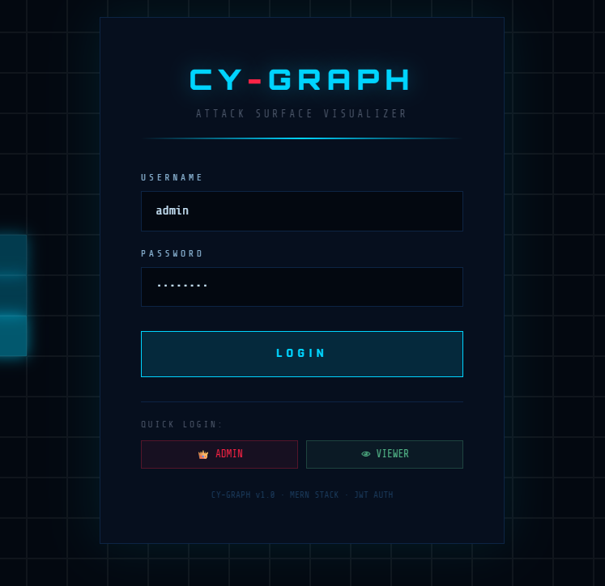
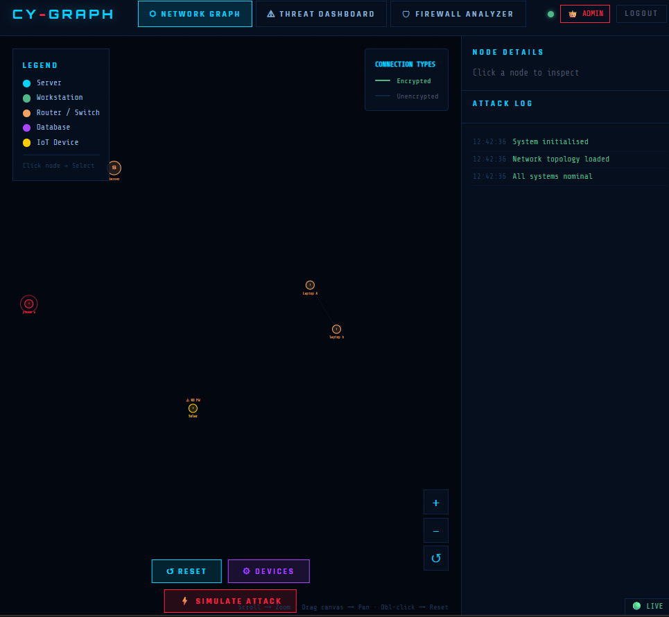

# CY-GRAPH — Real-Time Attack Surface Visualizer

A full-stack MERN application that visualizes corporate network topology
as an interactive force-directed graph and simulates cyberattack propagation
in real-time across multiple devices.

---

*ADMIN*

## Tech Stack

- **MongoDB Atlas** — Network map, attack logs, firewall rules
- **Express + Node.js** — REST API + BFS attack engine
- **Socket.io** — Real-time sync across all devices
- **React + Vite** — Frontend UI
- **D3.js** — Force-directed network graph
- **JWT + bcrypt** — Authentication

---

## Quick Start

### 1. Clone the repo
git clone https://github.com/YOUR_USERNAME/cy-graph.git
cd cy-graph

### 2. Backend setup
cd backend
npm install
Create .env file:
PORT=5000
MONGO_URI=your_mongodb_atlas_uri
JWT_SECRET=your_secret_key
npm run seed    # Seed database with 15 nodes, 20 edges, 2 users
npm run dev     # Start backend on port 5000

### 3. Frontend setup (new terminal)
cd frontend
npm install
npm run dev     # Start frontend on port 3000

### 4. Open in browser
http://localhost:3000

---

## Default Accounts

| Username | Password   | Role   | Access          |
|----------|------------|--------|-----------------|
| admin    | admin123   | Admin  | Full access     |
| viewer   | viewer123  | Viewer | Read-only       |

---

## Multi-Device Testing

All devices must be on the same WiFi network.

1. Find Laptop A's IP: `ipconfig` (Windows) or `ip addr` (Linux/Mac)
2. On Laptop B and Phone: open `http://[LaptopA_IP]:3000`
3. Login on any device — changes sync to all devices instantly

---

## Features

- **Network Graph** — Interactive D3 force-directed visualization
- **Attack Simulation** — BFS propagation respecting firewall rules  
- **Real-Time Sync** — Socket.io broadcasts to all connected devices
- **Threat Dashboard** — CVE table with NVD API integration
- **Firewall Analyzer** — Port scanner, rules manager, exposure score
- **JWT Auth** — Role-based access (Admin / Viewer)
- **Mobile Responsive** — Works on phone browsers

---

## Project Structure

cy-graph/
├── backend/         ← Node.js + Express + Socket.io
│   ├── models/      ← MongoDB schemas
│   ├── routes/      ← REST API endpoints
│   ├── socket/      ← BFS attack engine
│   └── server.js
└── frontend/        ← React + D3.js
    └── src/
        ├── pages/
        ├── components/
        ├── hooks/
        └── context/
